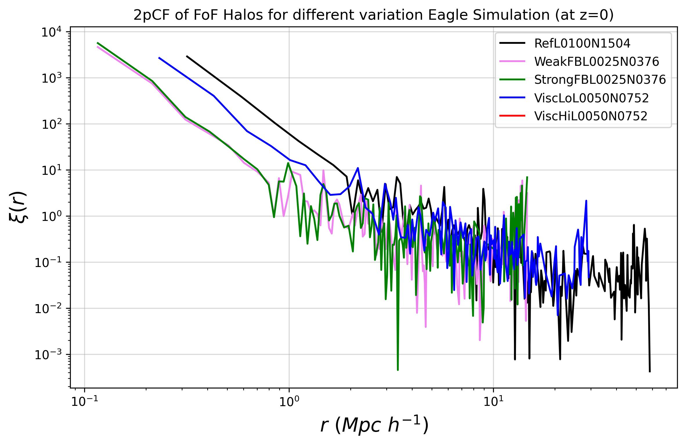

# *This folder contains code and data from Eagle simulations*

More organizational information will be updated as the project progress

**NOTE:** The HDF5 files will not be uploaded to GitHub. One should run the notebook file with caution as some sections might download large files.

- [`test.ipynb`](test.ipynb): As of now downloads the DM positonal data from Eagle `StrongFBL0025N0376` and `WeakFBL0025N0376`, plots the DM disttribution and computes the 2pCF. The accompanying pythton script file is also available for faster execution: [`plot.py`](plot.py).
- [`querry.sh`](querry.sh): It is a shell script that queries the catalog data and save it to a `.csv` file.  
The `.csv` are reasonable small ~80MB(for the biggest run) so you can download them. Make sure to remove the first few commented lines(lines starting with `#`) after saving of the `.csv` as the total output of the query is saved to these files and we don't need the query Metadata.
- [`test_catalog.ipynb`](test_catalog.ipynb) : As of now computes the 2pCF of Eagle simulaiton for `StrongFBL0025N0376` `WeakFBL0025N0376`, `ViscLoL0050N0752`, `ViscHiL0050N0752` and `RefL0100N1504` from FoF halos.

  
