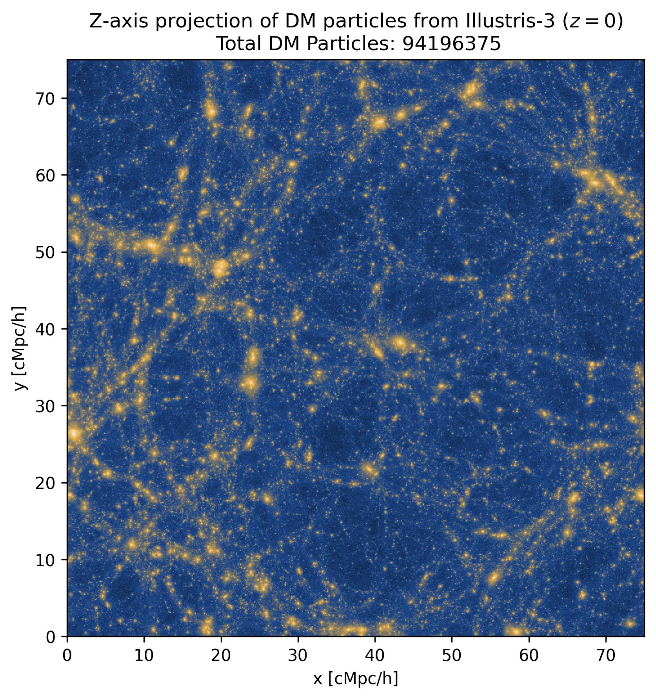

# *This folder contains code and data from Illustris and Illustris-TNG simulations*

More organizational information will be updated as the project progress.

**NOTE:** The HDF5 files will not be uploaded to GitHub. One should run the notebook file with caution as some sections might download large files.

- [`test.ipynb`](test.ipynb): As of now downloads the DM positonal data from Illustris 3, TNG300-3 run, plots the DM disttribution and computes the 2pCF.
- [`test_catalog.ipynb`](test_catalog.ipynb): As of now downloads the catalog data from TNG300-2,3 run and compute the 2pCF from *FoF* and *Subfind* Halos.
- The folder [`FinalProducts`](FinalProducts) contains the final products of the above analysis.
    
    - [`2pCF_TNG300-3.jpg`](FinalProducts/2pCF_TNG300-3.jpg): The 2pCF of the DM distribution in TNG300-3 run. 
    - [`2pCF_TNG300-3_Subfind_FOF.jpg`](FinalProducts/2pCF_TNG300-3_Subfind_FOF.jpg): The 2pCF of catalog data from TNG300-3 run using *Subfind* and *FOF* halos.
    - [`2pCF_TNG300-2_Subfind_FoF.jpg`](FinalProducts/2pCF_TNG300-2_Subfind_FoF.jpg): The 2pCF of catalog data from TNG300-2 run using *Subfind* and *FOF* halos.       
    **NOTE:** for TNG300-3 2pCF we don't have the fullscale 2pCF yet due to computational limitations. 
    - Rest of them are DM distribution images from different runs.
  
<!--  -->