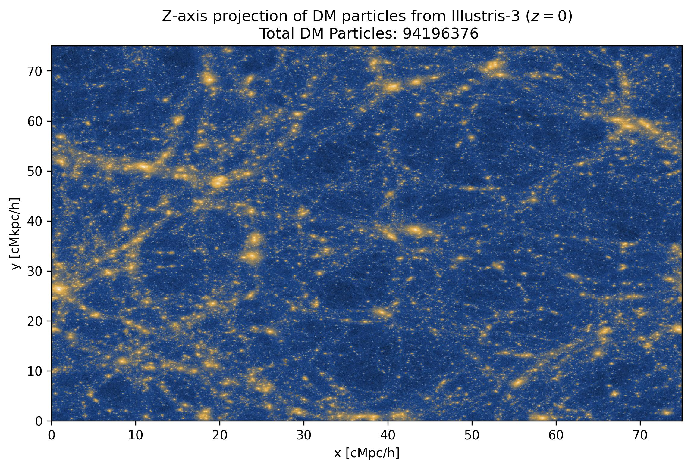

*This folder contains code and data from Illustris and Illustris-TNG simulations*

More organizational information will be updated as the project progress.

**NOTE:** The HDF5 files will not be uploaded to GitHub. One should run the notebook file with caution as some sections might download large files.

- [`test.ipynb`](test.ipynb): As of now downloads the DM positonal data from Illustris 3 run, plots the DM disttribution and computes the 2pCF.
  
